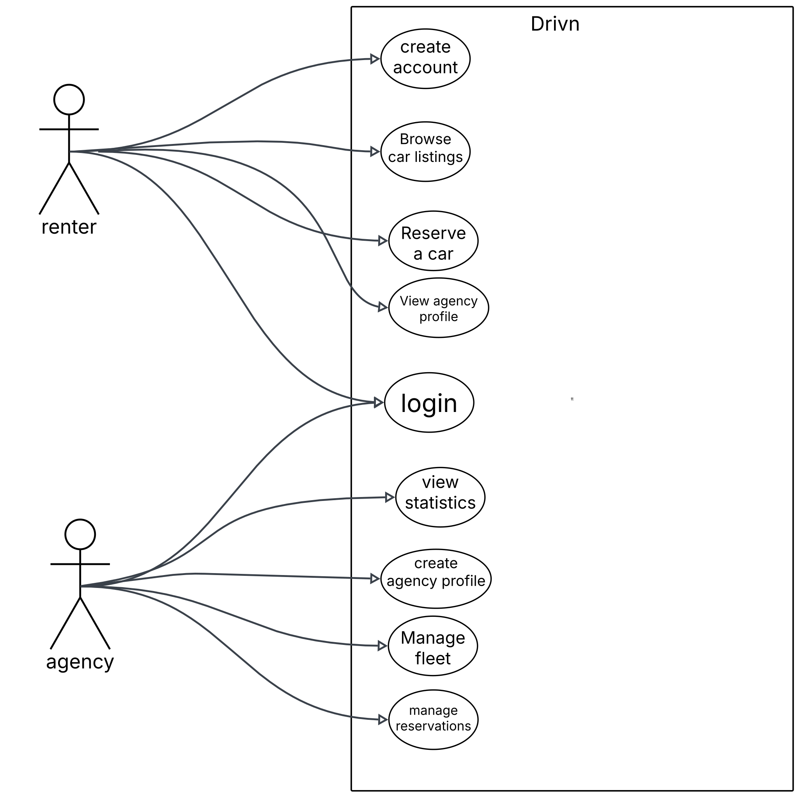

# Product & Technical Specification: Unified Car Rental Marketplace (MVP)

---

## 1. Executive summary & core objectives

### 1.1 problem statement

Local car rental agencies frequently operate without a dedicated digital presence or rely on rigid, poorly optimized website templates. this fragmentation reduces market visibility for agencies and forces consumers to navigate disjointed channels to compare and reserve vehicles.

### 1.2 solution

A unified, multi-tenant b2b2c marketplace that standardizes the rental process. small and mid-sized agencies get a dedicated dashboard to manage and list their fleets, while customers gain access to a centralized portal to search, compare, and request vehicle reservations.

### 1.3 use cases



### 1.3 MVP scope guardrails

- **no online payments:** bookings use an approval-based reservation system. financial transactions occur offline (cash/card at counter) during vehicle pickup.

---

## 2. system architecture & directory structure

The system uses a unified **turborepo monorepo** architecture to enforce compile-time type safety across the entire application ecosystem, allowing the client and api to share validation contracts directly.

### 2.1 workspace blueprint

```text
├── apps/
│   ├── client/               # frontend: react + vite + tailwind css + shadcn/ui
│   └── api/                  # backend: nestjs (modular architecture) + mongoose
├── packages/
│   └── shared/               # shared types, schemas, domain rules and permissions and validation contracts
```

### 2.2 system topography

- **client tier:** single page application (spa) utilizing a role-based router layout (public, renter, agency admin).
- **application tier:** modular express API.
- **data tier:** cloud hosted mongodb instance managed via mongoose ODM.

---

## 3. System Workflows & State Machines

### 3.1 The Booking Lifecycle (State Machine)

Reservations follow a strict, non-automated lifecycle entirely governed by the agency administrator.

| Initial Status | Event Trigger              | Authorized Role             | Target Status | Business Action                                        |
| -------------- | -------------------------- | --------------------------- | ------------- | ------------------------------------------------------ |
| **None**       | Submit Reservation Request | `customer`                  | `pending`     | Checks date availability collision. Holds time window. |
| **pending**    | Reject Request             | `agency_admin`              | `rejected`    | Releases car asset for the requested dates.            |
| **pending**    | Approve Request            | `agency_admin`              | `confirmed`   | Hard-locks vehicle time block.                         |
| **confirmed**  | Cancel Booking             | `customer` / `agency_admin` | `cancelled`   | Releases car asset.                                    |
| **confirmed**  | Process Vehicle Handover   | `agency_admin`              | `active`      | Car leaves the lot; client contract is open.           |
| **active**     | Return Vehicle & Inspect   | `agency_admin`              | `completed`   | Asset marked available immediately.                    |
